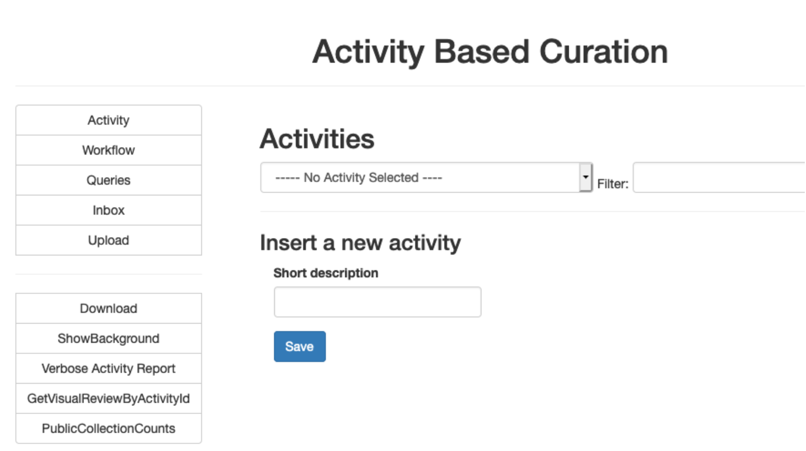
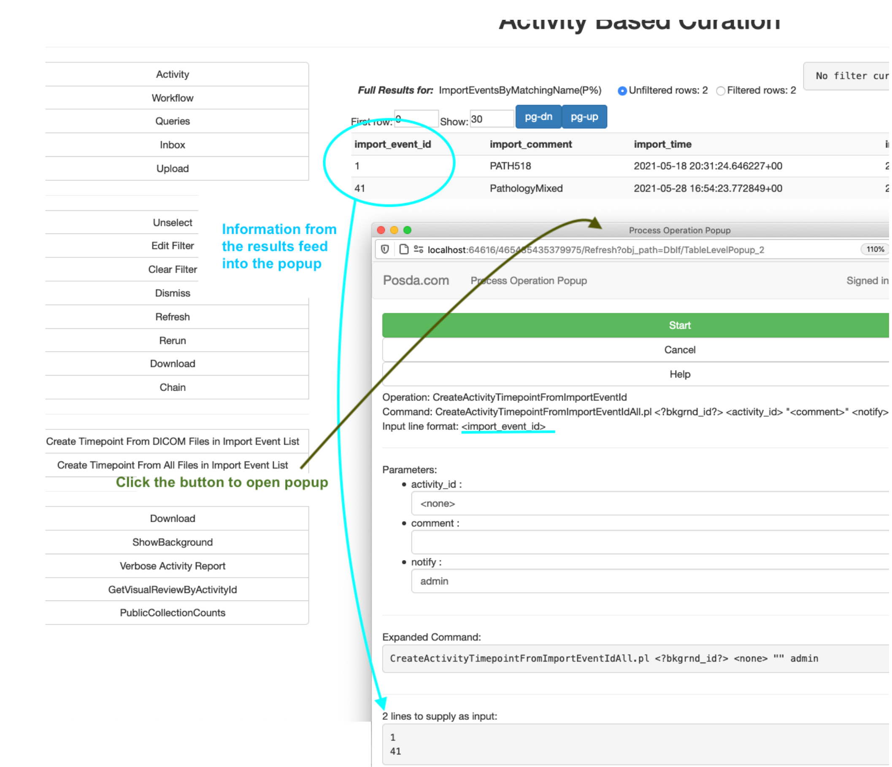

# Posda
  * A suite of tools used for the archival, curation, and de-identification of medical imaging datasets

Posda is a suite of medical image curation tools developed by the The Cancer Imaging Archive(TCIA) team. Originally the
"Perl Open Source DICOM Archive" tool, the project has expanded to include tools written in not only Perl, but also Python, Javascript, and more. In addition, while much of the functionality is focused on DICOM image files, many functions are now being designed to support other datatypes. The suite is hosted in a docker container, which contains the main Posda application, the database, and other applications and software tools used in the Posda
curation process.

For  image collections to be useful, the imaging data must be organized, and contain as much data as possible while avoiding revealing any personal health information(PHI). The TCIA team developed a process of curating the collections that is used to organize the collections, remove all personal health information, and leave as much useful data as possible. As part of that process, the Posda curation tools were developed.

Imaging collection curation is a process that many other projects and organizations could find useful. Perhaps you are part of a different project that manages image collections and wishes to make use of the Posda tool suite. Posda was envisioned to be agnostic to the
organization using it, so that other research projects can use these tools as part of their own curation process.

This is Posda, packaged as a set of docker containers (microservices).

## Installation Guide

https://code.imphub.org/projects/PT/repos/oneposda/browse/docs/src/installation.md

## User Guide

https://posda.com/wp-content/uploads/PosdaABC_11_23.pdf

The user guide for Posda  includes detailed explanations for curation and de-identification steps including:

 * Collection Preparation
 * Importing Data
 * Using Queries
 * Associate Imported Data with an Activity Timepoint
 * Create Timepoint From All Files in Import Event List
 * Patient Mapping
 * Run Count Checks
 * Check for Duplicate SOPs
 * Run Consistency Check
 * Verify DICOM IOD (Dciodvfy)
 * Visual Review
 * Removing Bad Data
 * PHI Review
 * Check Struct linkage
 * Link RT Data
 * Send to Server / Repository
 * Compare Posda Data to Server Data for verification

## License Info

© 2022 The Board of Trustees of the University of Arkansas

This project has been funded in whole or in part with federal funds from the National Cancer Institute, National Institutes of Health under grant U24CA215109 and Contract No. 75N91019D00024, Subcontract 20X023F. The content of this publication does not necessarily reflect the views or policies of the Department of Health and Human Services, nor does mention of trade names, commercial products, or organizations imply endorsement by the U.S. Government.

Licensed under the Apache License, Version 2.0 (the “License”); you may not use this file except in compliance with the License.

You may obtain a copy of the License at http://www.apache.org/licenses/LICENSE-2.0

Unless required by applicable law or agreed to in writing, software
distributed under the License is distributed on an “AS IS” BASIS,
WITHOUT WARRANTIES OR CONDITIONS OF ANY KIND, either express or implied.

https://posda.com

## Network Diagram

  &nbsp;&nbsp;&nbsp;&nbsp;{width=40%}

## Application Images

### Landing Page Example Screenshots

  &nbsp;&nbsp;&nbsp;&nbsp;{width=20%}
  &nbsp;&nbsp;&nbsp;&nbsp;{width=40%}

### Posda Main Application - Activity Based Curation Module-  Example Images and Screenshots

 * Activity Based Curation(ABC) module interface:
  &nbsp;&nbsp;&nbsp;&nbsp;{width=40%}
 * Query Page with labels:
  &nbsp;&nbsp;&nbsp;&nbsp;{width=40%}
 * Query Results:
  &nbsp;&nbsp;&nbsp;&nbsp;{width=40%}
 * ABC Running a process from query results with labels:
  &nbsp;&nbsp;&nbsp;&nbsp;{width=40%}
 * Example of Spreadsheet for Running DICOM Edits:
  &nbsp;&nbsp;&nbsp;&nbsp;{width=40%}
 * ABC Process Completion Results:
  &nbsp;&nbsp;&nbsp;&nbsp;{width=40%}
 * Example ABC Process Results with buttons to accept or reject proposed DICOM file edits:
  &nbsp;&nbsp;&nbsp;&nbsp;{width=40%}

### Posda Helper Applications -  Example Screenshots
 * Image Collection ID creation application: DICOM Roots Editor:
  &nbsp;&nbsp;&nbsp;&nbsp;{width=40%}
 * DICOM Visual Review application: Kaleidoscope:
  &nbsp;&nbsp;&nbsp;&nbsp;{width=40%}
 * DICOM lightweight viewer application: Quince:
  &nbsp;&nbsp;&nbsp;&nbsp;{width=25%}
