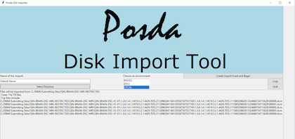

# This is the test guide for Posda.

## Things to consider
* Make sure your preferred browser will allow pop-ups from the posda application.
* Make sure you have a user account in Posda
* Ensure your version of Posda to be tested is installed and running
* Ensure you have the Posda Importer GUI installed on the machine you intend to test

## If running locally from scratch
* locate the oneposda directory
* open a terminal
* type `./init` this will update your docker image
* type `./manage up` this will bring up your database and applications

## Download the DicomTestSet test data
* Found here: https://pathology.cancerimagingarchive.net/download/other/DicomTestSet.tgz

## Import the Data for Creation

### Option 1: Using the Posda GUI importer
* Locate your copy of the DicomTestSet
* Open the Posda Importer GUI
  * 
* Click "Create New Import"
  * 
* Beginning on the left side of the window, Choose a name for the import
* Click Select Directory
  * 
* Select the DicomTestSet test data directory,
  * Data about the folder should appear in the window (Here is an example with non-DicomTestSet data, DicomTestSet has 628 files)
  * 
* Choose your Environment (Local for testing, Production for actual work, your options are handled in the config files)
* Click "Create Import Event and Begin"
* Wait for files to complete importing, since this is test data it should have 0 errors. Real data will often have issues to investigate using the Logs.
* Once the DicomTestSet data is fully imported you may close the application

### Option 2: Using DICOM Send
* Open the DicomTestSet directory in your preferred DICOM editor
* Setup the location for PosdaLocal in your preferences
* Select a subset of files to Send
* Click Send

## Open Posda and Login
* Go to the URL in your browser (if local, go to localhost)
  * You should arrive on the shared landing page for Posda and other related applications
  * 
* Click Posda Login
  * You are now on the Posda Login Page
* 
* In the upper right, put in your credentials and hit Submit
  * Once logged in the list of Apps your account has direct access to appears
  * 

## Open DBIF
* In the row labeled Dbif (Database Interface) click Launch
  * Wait for the popup window to load
  * If nothing happens confirm that your browser is allowing popups from localhost
  * 

## Create the Activity
* Go to Activity in the left side bar
  * 
* Create a New Activity by entering the name in the input text box
* Then Click Save
  * 

## Create the Activity Timepoint
* Select your new Activity from the DropDown
  * 
  * Your screen will refresh to the Activity Timeline
* Change the Mode to Queries
  * 
  * Select Search
  * This screen can find data queries that return useful information, You can search by query name or even by returned columns.
  * We will search for Name Matching `SeriesByMatchingImportEventInfo`
  * Click Search
  * Once the query returns Click the Foreground button
  * 
  * Click query
  * Select CreateTimepointFromSeriesList
    * input the parameters including the ID of your Activity
    * wait for  the query to finish
  * Inbox will become Red
  * Go to Inbox
  * Select the Message
  * Select File this Message
  * Click Yes

* Change the Mode to ActivityTimeline
  * 
  * You should now see the first step of your process documented!

* Change the Mode to ActivityOperations
  * 
  * Click the `Suggest Patient Mappings For Timepoint` Button
  * 
  
