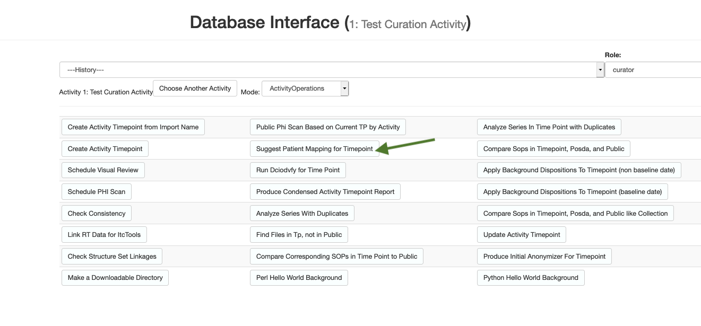
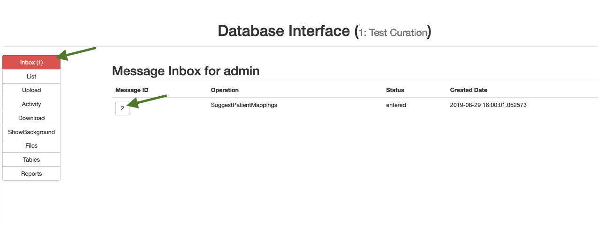
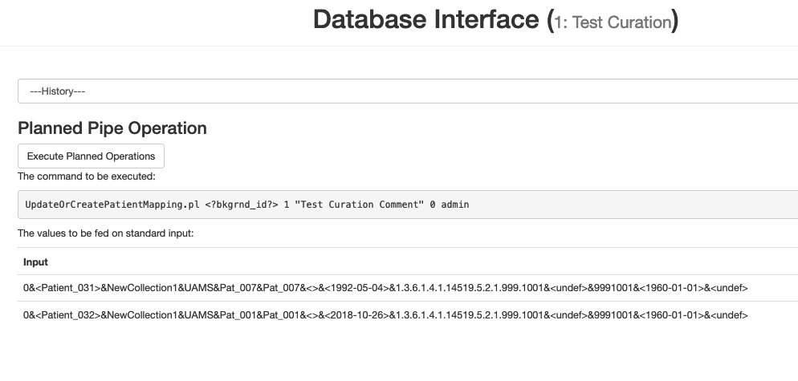
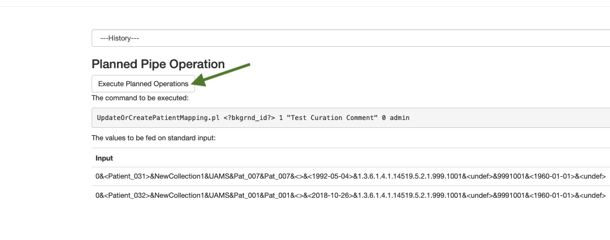

# This is the test guide for Posda.

## Things to consider
* Make sure your preferred browser will allow pop-ups from the posda application.
* Make sure you have a user account in Posda
* Ensure your version of Posda to be tested is installed and running
* Ensure you have the Posda Importer GUI installed on the machine you intend to test

## If running locally from scratch
* locate the oneposda directory
* open a terminal
* type `./init` this will update your docker image
* type `./manage up` this will bring up your database and applications

## Download the DicomTestSet test data
* Found here: https://pathology.cancerimagingarchive.net/download/other/DicomTestSet.tgz

## Import the Data for Creation

### Option 1: Using the Posda GUI importer
* Locate your copy of the DicomTestSet
* Open the Posda Importer GUI
  * 
* Click "Create New Import"
  * 
* Beginning on the left side of the window, Choose a name for the import
* Click Select Directory
  * 
* Select the DicomTestSet test data directory,
  * Data about the folder should appear in the window (Here is an example with non-DicomTestSet data, DicomTestSet has 628 files)
  * 
* Choose your Environment (Local for testing, Production for actual work, your options are handled in the config files)
* Click "Create Import Event and Begin"
* Wait for files to complete importing, since this is test data it should have 0 errors. Real datasets will sometimes have issues to investigate using the Logs.
* Once the DicomTestSet data is fully imported you may close the application

### Option 2: Using DICOM Send
* Open the DicomTestSet directory in your preferred DICOM editor
* Setup the location for PosdaLocal in your preferences
* Select a subset of files to Send
* Click Send

## Open Posda and Login
* Go to the URL in your browser (if local, go to localhost)
  * You should arrive on the shared landing page for Posda and other related applications
  * 
* Click Posda Login
  * You are now on the Posda Login Page
* 
* In the upper right, put in your credentials and hit Submit
  * Once logged in the list of Apps your account has direct access to appears
  * 

## Open DBIF
* In the row labeled Dbif (Database Interface) click Launch
  * Wait for the popup window to load
  * If nothing happens confirm that your browser is allowing popups from localhost
  * 

## Create the Activity
* Go to Activity in the left side bar
  * 
* Create a New Activity by entering the name in the input text box
* Then Click Save
  * 

## Create the Activity Timepoint
* Select your new Activity from the DropDown
* 
* Your screen will refresh to the  Activity Timeline
* Change the Mode to Queries
* 
* Select Search
* 
* This screen can find data queries that return useful information, You can search by query name or even by returned columns.
* We will search for Name Matching `SeriesByMatchingImportEventsWithEventInfo`
* Click Search
* 
* Once the query returns Click the Foreground button
* 
* in the boxes add `%` to represent *any*
*    
* Click query
* Wait for the query to complete
*   
* Click CreateActivityTimepointFromSeriesList
  *    
  * input the parameters including the ID of your Activity
  *    
  * Click Expand
  * Click Start Subprocess
  *    
  * wait for  the query to Begin
  * Once the screen updates to "Going to background" it is safe to close the popup
  *    
* Inbox will become Red when the process completes
* Go to Inbox
* This is your posda mail inbox, you will receive query result notifications here
*    
* Select the Message to view it
*   
* These are the results of the query you ran. In order to access them later in the Activity screen we will File the message.
* Select `File this Message`
*   
* Click Yes

## View the Activity Timeline
* Click Activity on the left menu
  * 
* Change the Mode to ActivityTimeline
  * 
* You should now see the first step of your process documented!
  * 
* Notice that you can see the current filecount of 628.
* If you click email, you can see the message we filed earlier. From there you can click the link to download a Timepoint Creation Report.
  * 

## Patient Mapping
* Change the Mode to ActivityOperations
  * 
* Note: The buttons on this page become blue the more they are used. This way you can visually note which actions are taken most often by your team.
* Click the `Suggest Patient Mappings For Timepoint` Button
  * 
* The parameter entry box for this operation appears
* 
* This operations will create a spreadsheet that we will load in to use for the following operations
* `col_name` is the name of a customized Column in the spreadheet. We will call it `NewCollection1`
* `crc` is the *collection root code* a 4 digit, unique code. It cannot have leading 0s. We will use `1001` in this example.
* `site_name` is your site name.
* `src` is the unique code 3 digit code for the site. You should choose the unique code for your site, if you do not have one yet use `999` for this example.
* `date_spec` is how you will shift dates to hide phi. You can either enter a shift amount or a baseline date. For this example we will use a baseline date of `1960-01-01`
* `pat_map_pat` is the patient mapping pattern for how the patients will be renamed. For this example we will use `Pat_<seq>`
* `num_dig` is the number of digits to be used in the sequence we specified above. For this example we will use `3`
* 
* Once all your input fields are correctly populated click Expand.
* Your popup should refresh to show the command parameters you entered
* Click Start Subprocess
* 
* Once the screen updates to "Going to background" it is safe to close the popup
* 
* When complete the Inbox will turn Red
* Click Inbox, then click the message id to view the message
* 
* These are the results of the query you ran. In order to access them later in the Activity screen we will File the message.
* Select `File this Message`
*   
* Click Yes
* Click Activity on the left menu
* 
* Change Mode to Activity Timeline
* 
* You should now see 2 entries in the Activity Timeline
* 
* Some steps will have updating status text
* 
* When this status is Done, we can move on
* Click email in the SuggestPatientMappings timeline record
* 
* In the popup you will see the message we filed.
* Click on the hyperlink to download the spreadsheet we created with the previous suggest patient mapping subprocess
* 
* Save the file when prompted
* 
* Navigate to the file on your machine. (default locations are often Documents or Downloads)
* Open the file with your preferred spreadsheet editor (Excel/Number/etc)
* 
* Now we can edit the file and upload it to use for further operations
* Any rows with an Operation specified will run that operation for that data
* In this case the suggested mappings process has found one patient that should have the UpdateOrCreatePatientMapping operation performed
* Go ahead and edit the comment column with a new comment `Test Curation Comment`
* 
* Save the file and close it, make sure you leave the file extension as .csv
* In the Posda DBIF window select Upload
* 
* Drag your saved file into the box, or click on the box to bring up a file selection window and choose your file.
* 
* The screen will display the upload progress of the file. When it is complete it should look like in the image below.
* 
* Click Tables on the left menu.
* 
* Here you can see the file you have uploaded.
* Click `Perform Operations`
* 
* The application has read in the spreadsheet you uploaded and determined that the operations displayed here have been requested, with the specified input
* 
* If everything looks right, Click `Execute Planned Operations` to begin the operation
* 
* Wait for the operation to complete
* When it completes the Inbox will highlight red with a new Message
* View and file your message as you have done before (Inbox, Message Id, File This Message, Yes)
* Then return to the Activity Timeline (Activity on the left, Mode:ShowActivityTimeline)
* You should see that the timeline now shows the UpdateOrCreatePatientMapping step that you just completed and filed.
* You've now completed the Patient Mappings step!
* The next steps of curation will proceed in a similar fashion.
  * You will run a process
  * File the result message
  * Download the spreadsheet from the filed message
  * Edit the spreadsheet and save it
  * Upload the edited sheet
  * Run the operations from the spreadsheet
  * File the completion Message
    * You may then need to View or Edit the resulting reports or spreadsheet
    * Or perform other steps needed in the message (some steps involve Accepting or Reject results)

## Initial Anonymizer
